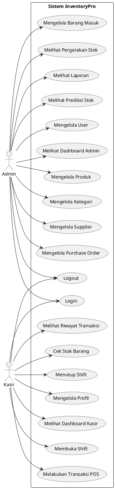
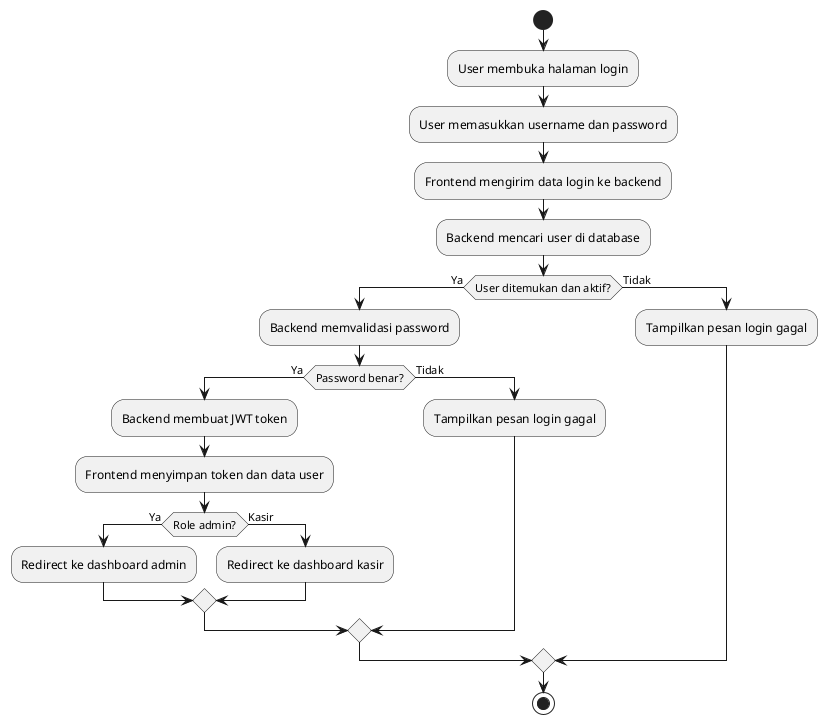
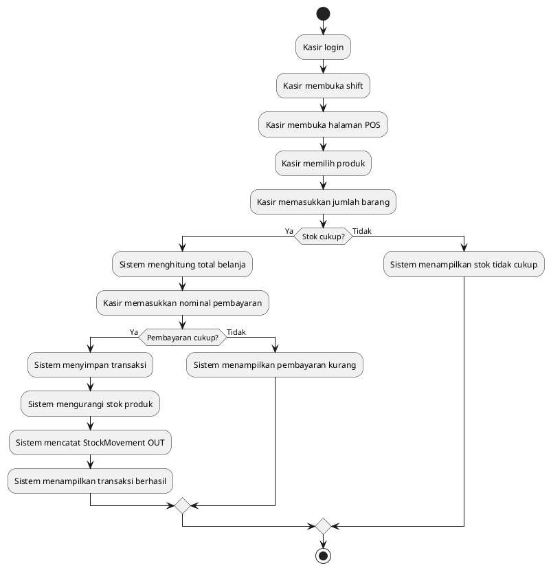
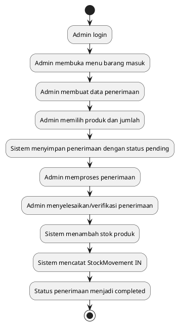
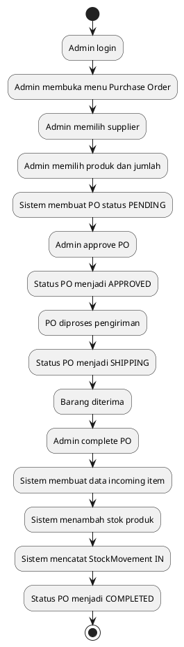
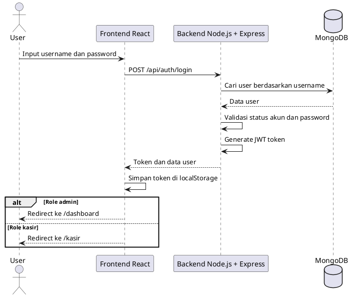
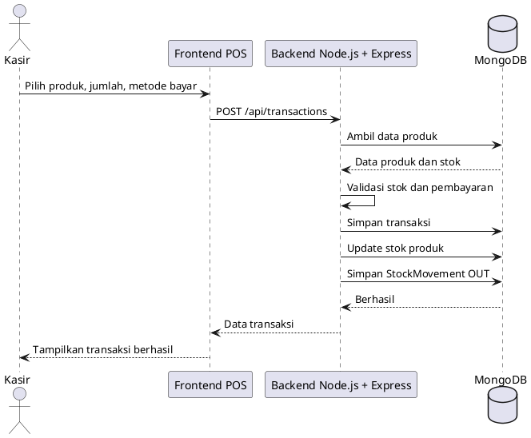
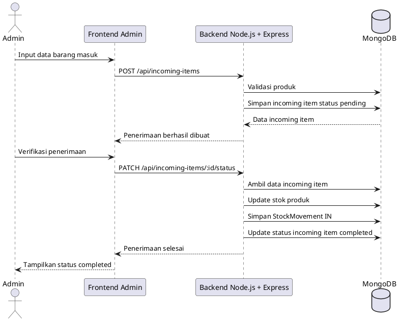
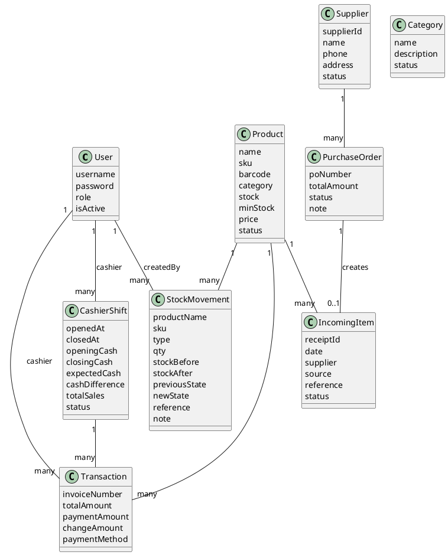

# Dokumentasi Sistem InventoryPro

## 1. Gambaran Umum Sistem

InventoryPro adalah sistem inventory dan point of sales berbasis web yang digunakan untuk mengelola data barang, stok, supplier, purchase order, penerimaan barang, laporan, prediksi stok, serta transaksi penjualan kasir.

Sistem memiliki dua role utama:

- Admin: mengelola data master, stok, pembelian, laporan, dan prediksi stok.
- Kasir: melakukan transaksi penjualan, mengelola shift, melihat riwayat transaksi, dan mengecek stok barang.

## 2. Arsitektur Sistem

Sistem menggunakan arsitektur client-server dengan pola three-tier architecture.

```text
Admin / Kasir
     |
     v
Frontend React + Vite
     |
     v
Backend Node.js + Express.js
     |
     v
MongoDB + Mongoose
```

Penjelasan tiap lapisan:

- Presentation Layer: frontend React yang menampilkan halaman admin dan kasir.
- Application Layer: backend Node.js dengan Express.js yang menyediakan REST API, autentikasi JWT, validasi data, dan business logic.
- Data Layer: MongoDB sebagai database, dengan Mongoose sebagai ODM untuk mengelola model data.

Teknologi yang digunakan:

| Komponen | Teknologi |
|---|---|
| Frontend | React, Vite, TypeScript, Tailwind CSS |
| Backend | Node.js, Express.js |
| Database | MongoDB |
| ODM | Mongoose |
| Autentikasi | JWT |
| Prediksi stok | Python LSTM dengan fallback moving average |

## 3. Role dan Hak Akses

| Role | Fitur |
|---|---|
| Admin | Dashboard admin, produk, kategori, supplier, purchase order, barang masuk, pergerakan stok, laporan, prediksi stok, manajemen user |
| Kasir | Dashboard kasir, POS, riwayat transaksi, shift kasir, cek stok, profil |

Setelah login, sistem membaca role user:

- Jika role admin, user diarahkan ke `/dashboard`.
- Jika role kasir, user diarahkan ke `/kasir`.

## 4. Proses Bisnis Sistem

### 4.1 Proses Bisnis Admin

```text
Admin login
 -> Admin mengelola data produk dan kategori
 -> Admin mengelola supplier
 -> Admin membuat purchase order
 -> Purchase order diproses sampai completed
 -> Sistem membuat data barang masuk
 -> Sistem menambah stok produk
 -> Sistem mencatat pergerakan stok IN
 -> Admin melihat dashboard, laporan, dan prediksi stok
```

Admin juga dapat mencatat barang masuk secara manual tanpa purchase order:

```text
Admin login
 -> Admin membuka menu barang masuk
 -> Admin membuat data penerimaan barang
 -> Admin memproses/verifikasi penerimaan
 -> Sistem menambah stok produk
 -> Sistem mencatat pergerakan stok IN
```

### 4.2 Proses Bisnis Kasir

```text
Kasir login
 -> Kasir membuka shift
 -> Kasir membuka halaman POS
 -> Kasir memilih produk dan jumlah barang
 -> Sistem memvalidasi stok
 -> Kasir memasukkan pembayaran
 -> Sistem menyimpan transaksi
 -> Sistem mengurangi stok produk
 -> Sistem mencatat pergerakan stok OUT
 -> Kasir menutup shift
```

## 5. Modul Sistem

| Modul | Fungsi |
|---|---|
| Auth | Login, validasi token, profil user |
| User | Manajemen user admin/kasir |
| Product | CRUD produk, stok, harga, SKU, barcode |
| Category | CRUD kategori produk |
| Supplier | CRUD supplier |
| Purchase Order | Membuat dan memproses pesanan pembelian |
| Incoming Item | Mencatat dan memverifikasi barang masuk |
| Stock Movement | Mencatat histori stok masuk dan keluar |
| Transaction | Transaksi POS kasir |
| Cashier Shift | Buka shift, tutup shift, rekap kasir |
| Dashboard | Ringkasan stok, aktivitas terbaru, notifikasi |
| Report | Laporan stok, transaksi, nilai inventory, metode pembayaran |
| Forecast | Prediksi kebutuhan stok |

## 6. Use Case Diagram



## 7. Activity Diagram

### 7.1 Activity Diagram Login



### 7.2 Activity Diagram Transaksi POS



### 7.3 Activity Diagram Barang Masuk



### 7.4 Activity Diagram Purchase Order



## 8. Sequence Diagram

### 8.1 Sequence Diagram Login



### 8.2 Sequence Diagram Transaksi POS



### 8.3 Sequence Diagram Barang Masuk



## 9. Class Diagram / Model Data



## 10. DFD Level 0

```text
Admin/Kasir
   |
   | input login, data master, PO, transaksi, barang masuk
   v
Sistem InventoryPro
   |
   | simpan/ambil data
   v
Database MongoDB

Sistem InventoryPro
   |
   | dashboard, laporan, stok, riwayat transaksi
   v
Admin/Kasir
```

## 11. DFD Level 1

```text
1.0 Autentikasi
Input: username, password
Output: token JWT, data user
Data store: User

2.0 Manajemen Produk dan Stok
Input: data produk, kategori, barang masuk, transaksi keluar
Output: stok terbaru, status stok
Data store: Product, Category, StockMovement

3.0 Manajemen Pembelian
Input: supplier, purchase order, status PO
Output: PO, barang masuk, stok bertambah
Data store: Supplier, PurchaseOrder, IncomingItem, Product

4.0 Transaksi Kasir
Input: item penjualan, pembayaran, metode pembayaran
Output: invoice, stok berkurang, histori transaksi
Data store: Transaction, Product, StockMovement, CashierShift

5.0 Laporan dan Dashboard
Input: data produk, stok, transaksi, PO, supplier
Output: ringkasan dashboard, laporan, prediksi stok
Data store: Product, StockMovement, Transaction, PurchaseOrder, Supplier
```

## 12. Rancangan Database

Collection utama:

| Collection | Fungsi |
|---|---|
| user | Menyimpan akun admin dan kasir |
| product | Menyimpan data produk dan stok |
| category | Menyimpan kategori produk |
| suppliers | Menyimpan data supplier |
| purchase_orders | Menyimpan data purchase order |
| incoming_items | Menyimpan data penerimaan barang |
| stock_movements | Menyimpan histori stok masuk/keluar |
| transactions | Menyimpan transaksi penjualan kasir |
| cashier_shifts | Menyimpan data shift kasir |

Relasi utama:

- User memiliki banyak Transaction.
- User memiliki banyak CashierShift.
- Product memiliki banyak StockMovement.
- Supplier memiliki banyak PurchaseOrder.
- PurchaseOrder dapat menghasilkan IncomingItem.
- Transaction mengurangi stok Product.
- IncomingItem dan PurchaseOrder completed menambah stok Product.

## 13. Endpoint Utama Backend

| Endpoint | Fungsi |
|---|---|
| `/api/auth/login` | Login user |
| `/api/auth/profile` | Mengambil profil user |
| `/api/users` | Manajemen user |
| `/api/products` | Manajemen produk |
| `/api/categories` | Manajemen kategori |
| `/api/suppliers` | Manajemen supplier |
| `/api/purchase-orders` | Manajemen purchase order |
| `/api/incoming-items` | Manajemen barang masuk |
| `/api/stock-movements` | Histori pergerakan stok |
| `/api/transactions` | Transaksi POS |
| `/api/cashier-shifts` | Shift kasir |
| `/api/dashboard` | Dashboard admin |
| `/api/reports` | Laporan |
| `/api/forecast` | Prediksi stok |

## 14. Poin Presentasi Ke Dosen

Poin pembuka:

> Sistem yang saya bangun adalah InventoryPro, yaitu aplikasi inventory dan POS berbasis web. Sistem ini memiliki dua role, yaitu Admin dan Kasir. Admin bertugas mengelola produk, kategori, supplier, purchase order, penerimaan barang, laporan, dan prediksi stok. Kasir bertugas melakukan transaksi penjualan, membuka dan menutup shift, melihat riwayat transaksi, serta mengecek stok.

Poin arsitektur:

> Arsitektur sistem menggunakan client-server dan three-tier architecture. Frontend dibangun menggunakan React dan Vite, backend menggunakan Node.js dengan Express.js, sedangkan database menggunakan MongoDB dengan Mongoose.

Poin proses bisnis:

> Proses stok pada sistem terbagi menjadi dua, yaitu stok masuk dan stok keluar. Stok masuk berasal dari penerimaan barang atau purchase order yang sudah completed. Stok keluar berasal dari transaksi POS kasir. Setiap perubahan stok dicatat pada stock movement sehingga histori stok dapat dipantau.

Poin keamanan:

> Sistem menggunakan JWT untuk autentikasi. Setelah login, token disimpan di frontend dan dikirim pada setiap request ke backend. Sistem juga membedakan akses berdasarkan role admin dan kasir.

Poin keunggulan:

> Selain fitur inventory dan POS, sistem juga memiliki laporan, dashboard stok, notifikasi stok rendah/kritis, histori pergerakan stok, shift kasir, serta fitur prediksi stok.

## 15. Catatan Untuk Revisi

Hal yang bisa ditambahkan jika dosen meminta penguatan:

- Tambahkan role-based authorization lebih ketat pada endpoint admin seperti produk, kategori, supplier, PO, laporan, dan dashboard.
- Tambahkan route guard di frontend agar user tidak bisa membuka halaman role lain secara langsung.
- Tambahkan export laporan ke PDF/Excel jika belum lengkap.
- Tambahkan struk transaksi POS jika diperlukan untuk kebutuhan kasir.

