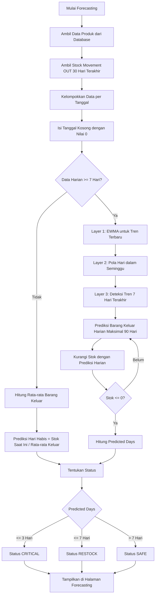
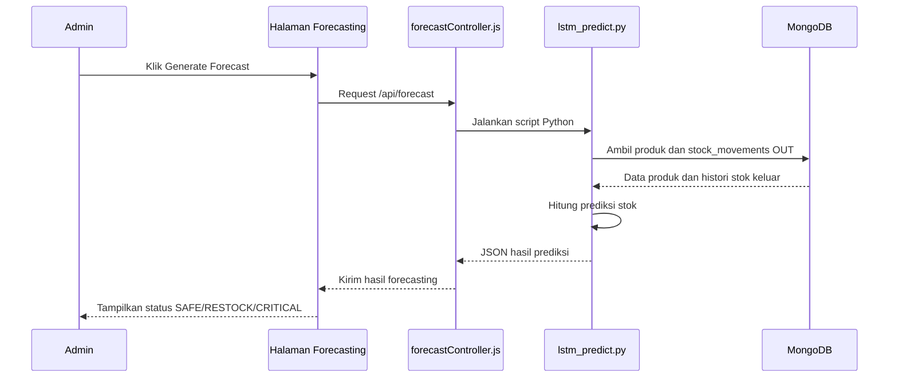
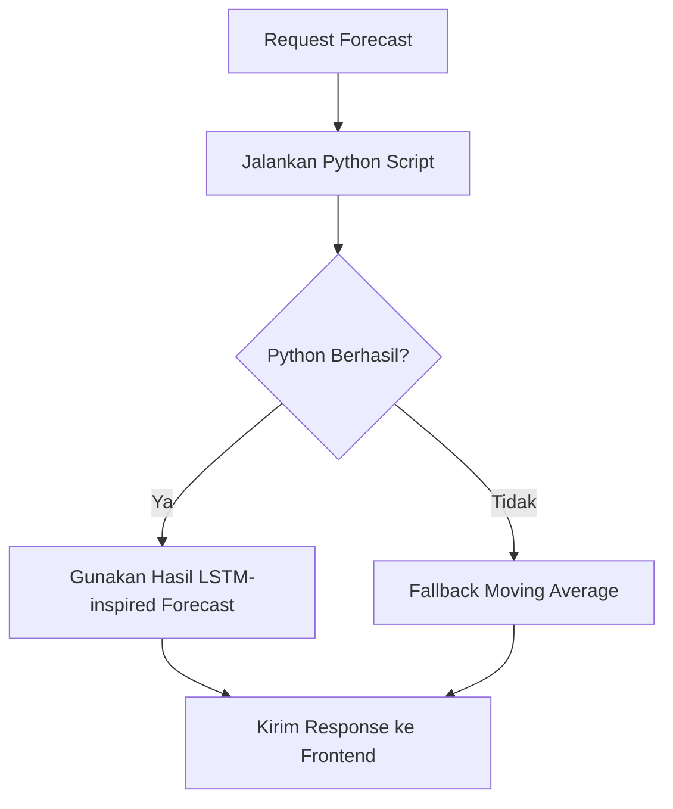
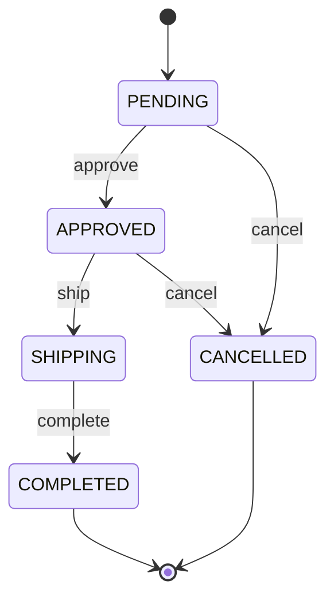
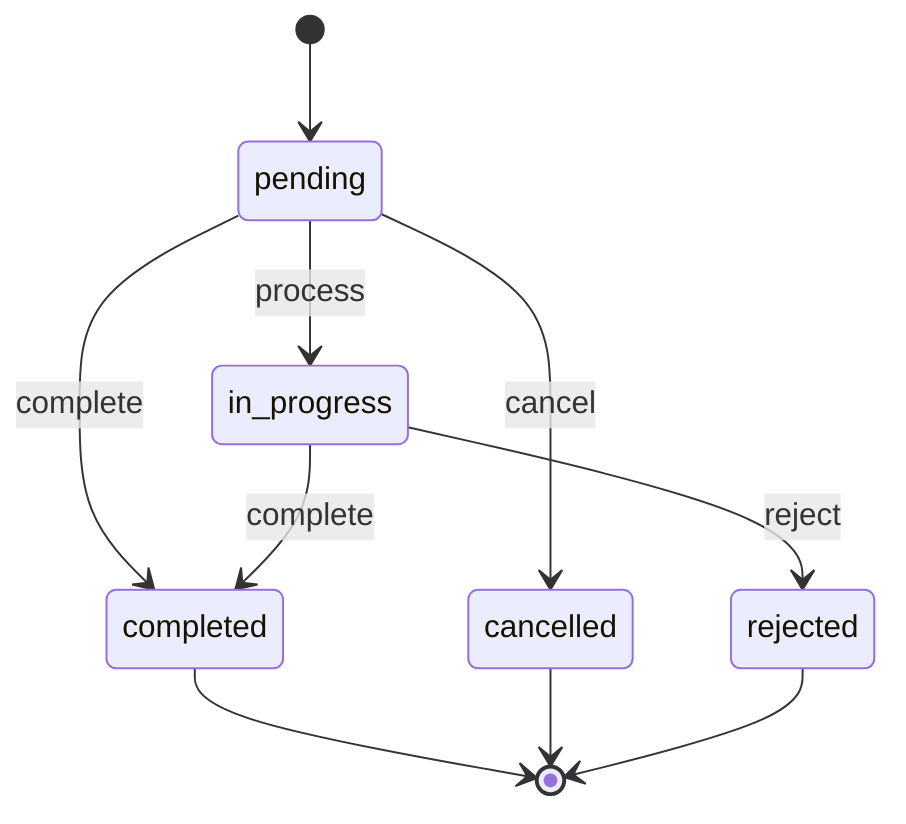
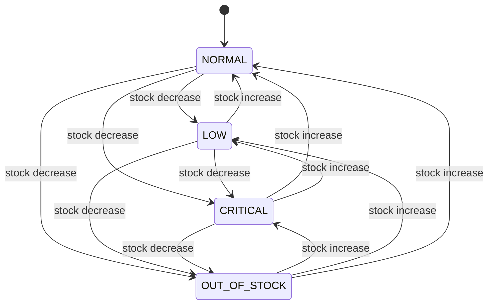
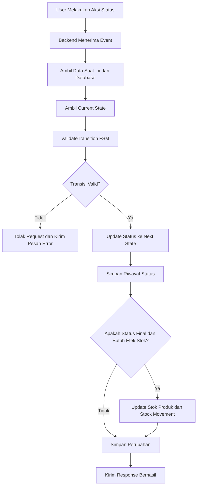
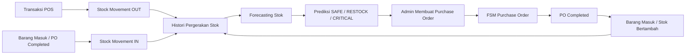

# Visualisasi Flow Model LSTM dan FSM InventoryPro

Dokumen ini menjelaskan alur visual model forecasting stok dan Finite State Machine (FSM) yang digunakan pada aplikasi InventoryPro.

## 1. Gambaran Umum

InventoryPro menggunakan dua pendekatan model:

1. **Model forecasting stok berbasis time series**
   Digunakan untuk memprediksi estimasi berapa hari stok produk akan habis berdasarkan histori barang keluar.

2. **Finite State Machine (FSM)**
   Digunakan untuk mengatur perubahan status agar alur bisnis tetap valid, terutama pada Purchase Order, Barang Masuk, dan status stok produk.

Catatan akademik: implementasi forecasting pada kode saat ini menggunakan pendekatan **LSTM-inspired time series forecasting**, yaitu kombinasi EWMA, pola mingguan, dan faktor tren. Jika dosen meminta LSTM neural network murni, bagian ini perlu dijelaskan sebagai versi ringan atau dikembangkan lagi menjadi model LSTM sebenarnya.

---

## 2. Flow Forecasting Stok

### Penjelasan Input dan Output

| Bagian | Keterangan |
| --- | --- |
| Input utama | Produk, stok saat ini, minimum stok, histori barang keluar |
| Sumber data | `Product` dan `StockMovement` |
| Periode histori | 30 hari terakhir |
| Output | `avgOut`, `predictedDays`, `predictedDaily`, dan status |
| Status hasil | `SAFE`, `RESTOCK`, `CRITICAL` |

---

## 3. Flow Integrasi Forecasting pada Sistem

Jika script Python gagal dijalankan, backend menggunakan fallback prediksi sederhana berbasis moving average.

---

## 4. FSM Purchase Order

FSM Purchase Order mengatur agar status PO hanya dapat berubah melalui urutan yang valid.

### Tabel Transisi Purchase Order

| State Saat Ini | Event | State Berikutnya |
| --- | --- | --- |
| PENDING | approve | APPROVED |
| PENDING | cancel | CANCELLED |
| APPROVED | ship | SHIPPING |
| APPROVED | cancel | CANCELLED |
| SHIPPING | complete | COMPLETED |
| COMPLETED | - | Final state |
| CANCELLED | - | Final state |

### Contoh Validasi

Jika PO sudah `COMPLETED`, sistem tidak mengizinkan status diubah lagi karena `COMPLETED` adalah final state.

---

## 5. FSM Barang Masuk

FSM Barang Masuk mengatur alur penerimaan barang agar stok hanya bertambah ketika proses penerimaan sudah valid.

### Tabel Transisi Barang Masuk

| State Saat Ini | Event | State Berikutnya |
| --- | --- | --- |
| pending | process | in_progress |
| pending | complete | completed |
| pending | cancel | cancelled |
| in_progress | complete | completed |
| in_progress | reject | rejected |
| completed | - | Final state |
| cancelled | - | Final state |
| rejected | - | Final state |

---

## 6. FSM Status Stok Produk

FSM status stok produk dihitung otomatis berdasarkan nilai `stock` dan `minStock`.

### Aturan Penentuan Status

| Kondisi | Status |
| --- | --- |
| `stock <= 0` | OUT_OF_STOCK |
| `stock <= minStock * 0.25` | CRITICAL |
| `stock <= minStock` | LOW |
| `stock > minStock` | NORMAL |

---

## 7. Flow Penggunaan FSM di Backend

---

## 8. Hubungan LSTM-inspired Forecasting dan FSM

Alur ini menunjukkan bahwa forecasting membantu admin mengambil keputusan restock, sedangkan FSM memastikan proses restock berjalan melalui status yang valid.

---

## 9. Ringkasan untuk Presentasi ke Dosen

1. Data transaksi dan pergerakan stok dicatat sebagai histori.
2. Histori barang keluar 30 hari terakhir digunakan sebagai input forecasting.
3. Model menghitung tren, pola mingguan, dan rata-rata prediksi barang keluar.
4. Sistem menghasilkan estimasi hari sampai stok habis.
5. Hasil prediksi diklasifikasikan menjadi `SAFE`, `RESTOCK`, atau `CRITICAL`.
6. Ketika admin melakukan restock, FSM memastikan status PO dan Barang Masuk mengikuti alur yang valid.
7. Setelah barang masuk selesai, stok bertambah dan histori baru digunakan lagi untuk prediksi berikutnya.
